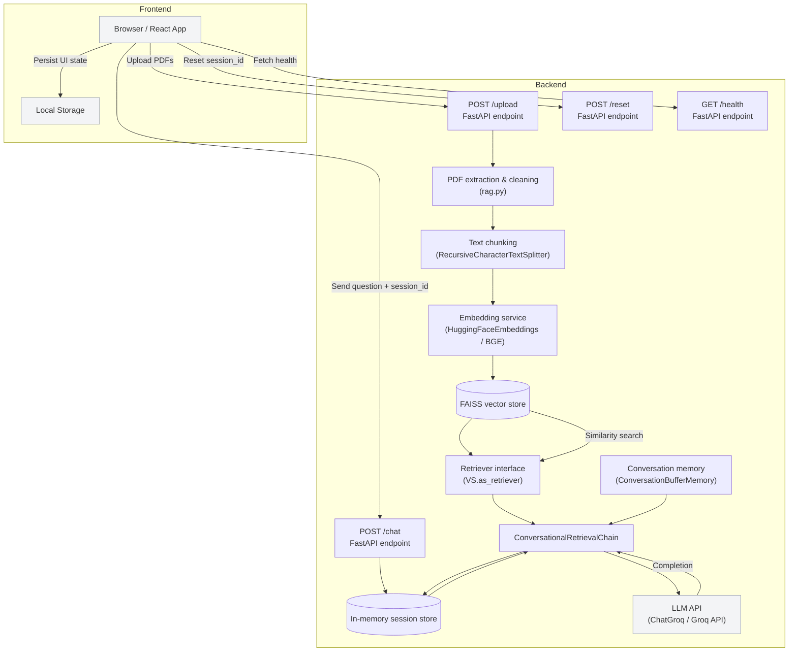

# Glyph Architecture

This document describes the architecture of the Glyph PDF chat application.
It covers the frontend, backend, document processing pipeline, and external services.

## High-level architecture

## Components

### Frontend
- `frontend/src/App.jsx`
- React + Vite application
- Handles file selection, drag-and-drop, upload validation, chat UI, and local state persistence
- Calls backend endpoints:
  - `POST /upload` with PDF files
  - `POST /chat` with `session_id` and a question
  - `POST /reset` to clear session state

### Backend
- `backend/main.py`
- FastAPI application running under `uvicorn`
- Accepts upload and chat requests, enforces file size / count limits, and manages session state
- Uses CORS middleware to allow the React app to call the backend from a different origin in development

### Document processing & RAG pipeline
- `backend/rag.py`
- Extracts PDF text using `fitz` (PyMuPDF) and `pypdf` fallback
- Cleans and normalizes extracted text
- Splits text into overlapping chunks using `RecursiveCharacterTextSplitter`
- Embeds chunks using `HuggingFaceEmbeddings` with the `BAAI/bge-small-en-v1.5` model
- Builds an in-memory FAISS vector store from the embedded chunks
- Creates a `ConversationalRetrievalChain` that uses:
  - `ChatGroq` for language model responses via the Groq API
  - a retriever for similarity search over stored chunks
  - `ConversationBufferMemory` to preserve chat history per session

### Session lifecycle
- Each successful `/upload` request creates a new `session_id`
- Backend stores `{ chain, last_used }` in a global `sessions` dictionary
- Subsequent `/chat` requests retrieve the session by `session_id`
- Session entries are garbage-collected after 1 hour of inactivity
- `/reset` optionally clears the session from memory

## Data flow

1. User opens the web app in the browser.
2. User uploads one or more PDF files.
3. Frontend sends the files to `POST /upload`.
4. Backend extracts and cleans text from the PDFs.
5. The text is split into chunks and embedded into vector vectors.
6. A FAISS index is created for the session, and the retrieval chain is built.
7. Backend returns a `session_id` to the frontend.
8. User submits a question.
9. Frontend sends the question along with `session_id` to `POST /chat`.
10. Backend retrieves the session, performs similarity search, and calls Groq for generation.
11. Response and chat history are returned to the frontend.
12. User can reset the chat, which clears the backend session and resets the UI.

## External services and dependencies

- Groq API: remote LLM inference via `langchain_groq.ChatGroq`
- HuggingFace-style embeddings model: `BAAI/bge-small-en-v1.5`
- FAISS: local vector similarity search
- PDF parsing libraries: `fitz` and `pypdf`
- Local browser storage: `window.localStorage` for UI state persistence

## Deployment notes

- Frontend runs on Vite development server in `frontend/`
- Backend runs on FastAPI / Uvicorn in `backend/`
- The React app expects the backend at `http://127.0.0.1:8000` by default
- Sessions and vector stores are ephemeral and cleared when the backend restarts
- Production should tighten CORS and consider persistent storage for vectors and sessions
